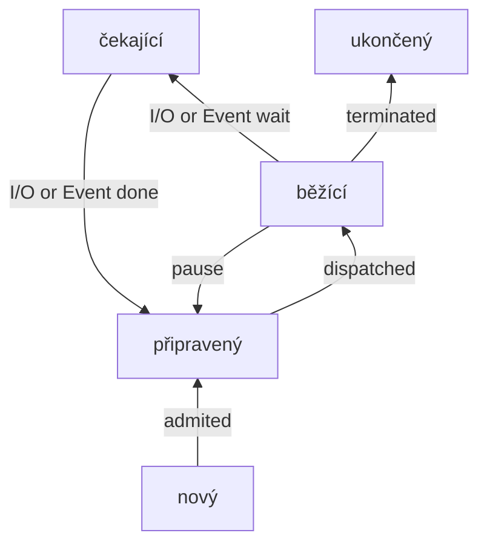

## Procesy
- neformálně: **proces** = **běžící program** (vykonávaná činnost)
- Každý proces má svůj vlastní **virtuální adresní prostor**
	- procesy jsou od sebe **izolovány** a neovlivňují se navzájem při standardním běhu.
	- Obsahuje **kód programu, paměťový prostor, data, zásobník, registry**
- Operační systém **spravuje** a **organizuje** procesy
- Komunikace mezi procesy a sdílení zdrojů vyžaduje **synchronizaci**

>[!Example] Plánování procesů
>1. **uložení stavu CPU do PCB** (Process Control Block) aktuálního procesu
>2. **aktualizace** PCB (změna stavu, ...)
>3. zařazení procesu do příslušné fronty
>4. volba nového procesu
>5. aktualizace datových struktur pro nový proces
>6. načtení kontextu z PCB nového procesu

## Vlákna
- procesy jsou od sebe izolovány, což nemusí být vždy žádoucí
- proces obecně slouží pro správu zdrojů (data, kód), vlákno vykonává kód
- proces může mít více vláken
- každé vlákno má své registry, zásobník `IP`, stav (stejně jako proces)
	- zbytek zdrojů je sdílený
- Využití vláken:
	- rozdělení běhu na popředí a na pozadí
	- asynchronní zpracování dat
	- víceprocesorové stroje
	- modulární architektura

>[!Tip] Vztah proces-vlákno v různých systémech:
>- $1:1$ - proces = vlákno
>- $1:\text{N}$ - proces může mít více vláken (nejčastější řešení)
>- $\text{N}:1\ /\text{ M}:\text{N}$ - více procesů pracuje s jedním vláknem (clustery)
## Plánování běhu procesů
- potřeba efektivně plánovat procesorový čas
- samotné přepnutí procesu vyžaduje režii $\rightarrow$ latence navíc
### Požadavky na plánování procesů
- **spravedlnost** - každý proces by v rozumné době měl mít přiděleno CPU
- **vyváženost** - celý systém běží
- **efektivita** - maximální využití CPU
- **maximalizace odvedené práce**
- **minimalizace doby odezvy**

### Algoritmy pro plánování procesů
1. **First-Come-First-Served**
	- první proces získá procesor
	- nové procesy čekají ve frontě
	- jednoduchý, neefektivní
2. **Shortest Job First**
	- vybere se takový proces, který poběží nejkratší dobu
	- zlepšuje celkovou průchodnost systémem
	- potřeba znát čas, který proces potřebuje
3. **Shortest Remaining Time Next**
	- pokud nový proces potřebuje k dokončení méně času než aktuální, je spuštěn
4. **Round robin**
	- každý proces má pevně stanovené kvantum
	- připravené procesy jsou řazeny ve frontě a postupně dostávají CPU
	- vhodné pro obecné použití (poměrně spravedlivý)
5. **Prioritní fronta**
	- každý proces má definovanou prioritu
	- statické $\times$ dynamické nastavení priority
	- systém eviduje pro každou prioritu frontu
	- riziko vyhladovění procesů s nízkou prioritou
6. **Completely Fair Scheduler**
	- varianta Guaranteed scheduleru
	- používán v Linuxu
	- tasky organizovány v RB-stromu (podle toho, kolik dostaly času)
	- je zvolen ten, který získal nejméně času (nejlevnější list)

## Komunikace a synchronizace
-   je nezbytná pro správnou spolupráci a zamezení problémům jako je deadlock (uváznutí) nebo race conditions (souběžný přístup ke sdíleným zdrojům).

- **Kritická sekce**: část kódu, kdy program pracuje se sdílenými zdroji
	- pokud je jeden proces v kritické sekci, další do ní nesmí vstoupit
- **Požadavky na kritickou sekci**:
	- vzájemné vyloužení
	- absence zbytečného čekání
	- zaručený vstup
- Jedním ze základních synchronizačních primitiv je **Semafor**
	- je to chráněná proměnná obsahující počítadlo s celými čísly
	- je nutné, aby využíval **atomické operace**
- Další synchronizační nástroje:
	- Bariéry
	- Read-Write zámky
	- Monitor
##### Navigace
Předchozí: [[Vykonávání programu a proces překladu]]
Následující: [[Problém uváznutí, jeho detekce a metody předcházení]]
Celý okruh: [[2. Informační technologie]]